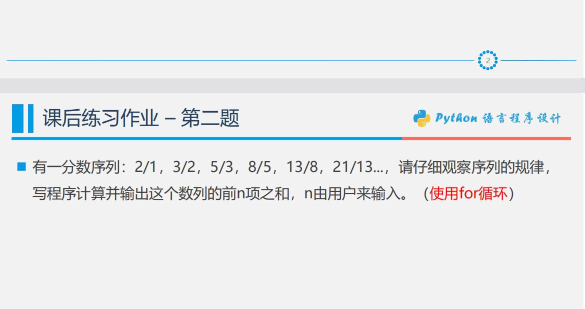

<!--
 * @Author: your name
 * @Date: 2021-01-29 20:57:13
 * @LastEditTime: 2021-01-29 21:27:50
 * @LastEditors: Please set LastEditors
 * @Description: In User Settings Edit
 * @FilePath: /vuepress-starter/docs/JavaScript/arg/a.md
-->
# fibonacci



```js
function fibonacci(n, v1, v2) {
    const fibonacciList = []
    function fib(n, v1, v2) {
        if (n == 1) {
          fibonacciList.push(v1)
          return
        } else if (n == 2) {
          fibonacciList.push(v1)
          return
        } else {
          fibonacciList.push(v1)
          fib(n - 1, v2, v1 + v2)
        }
    }
    fib(n, v1, v2)
    return fibonacciList
}

const father = fibonacci(5, 1, 2)
const son = fibonacci(5, 2, 3)
const sum3 = son.map((item, index) => {
    return [item, father[index]]
  }
)
const res = sum3.reduce((acc, cur) => acc + cur[0] / cur[1], 0)
```